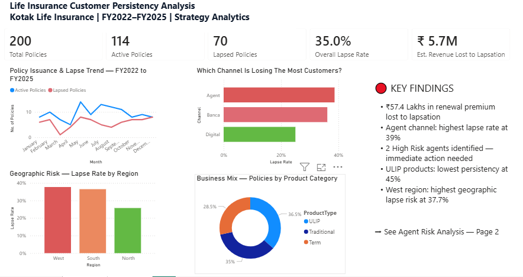
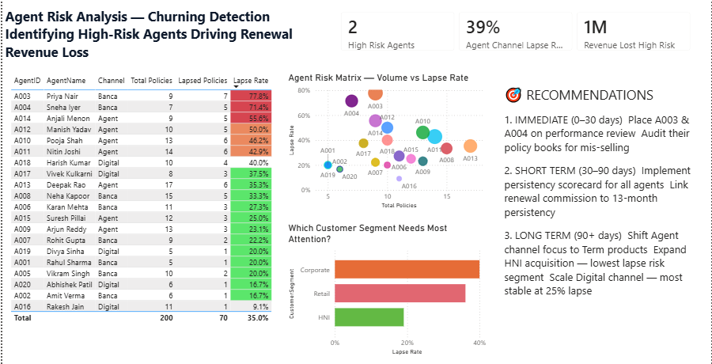

# 🏦 Life Insurance Customer Persistency Analysis


## Business Problem
A life insurance company reported a **22% profit decline** in Q2. 
New business premium was up 12% but renewal premium dropped 31%. 
This project diagnoses the root cause and quantifies the revenue impact.

## Methodology
```
Excel → Data Creation & Validation
SQL   → 8 Business Queries for Analysis  
Power BI → Executive Dashboard (2 Pages)
Framework → Profitability Analysis + Root Cause Analysis
```

## Dataset
Mock dataset created with realistic BFSI business logic:
- **Policies** — 200 rows
- **Customers** — 200 rows  
- **Agents** — 20 rows
- **Premiums Collected** — 500 rows
- **Claims** — 50 rows

## Key Findings

| # | Finding | Impact |
|---|---------|--------|
| 1 | 2 High Risk churning agents detected | Root cause identified |
| 2 | ₹57.4 Lakhs renewal revenue lost | Business impact quantified |
| 3 | ULIP lowest persistency at 45% | Product risk flagged |
| 4 | HNI segment only 19% lapse rate | Retention opportunity |
| 5 | West region highest risk at 37.7% | Geographic intervention |

## Dashboard

### Page 1 — Executive Summary


### Page 2 — Agent Risk Analysis


## SQL Queries
8 business queries covering:
- Lapse rate by channel
- Churning agent detection with risk labels
- 13th month persistency by product
- Revenue lost to lapsation
- Customer segment performance

## Recommendations
1. **Immediate** — Place A003 & A004 on performance review
2. **Short Term** — Implement agent persistency scorecard
3. **Long Term** — Shift focus to HNI acquisition & Digital channel

## Author
**Mujahid Khan** — Strategy & Analytics Professional  
[Email](mailto:khanmujahid00786@gmail.com)
